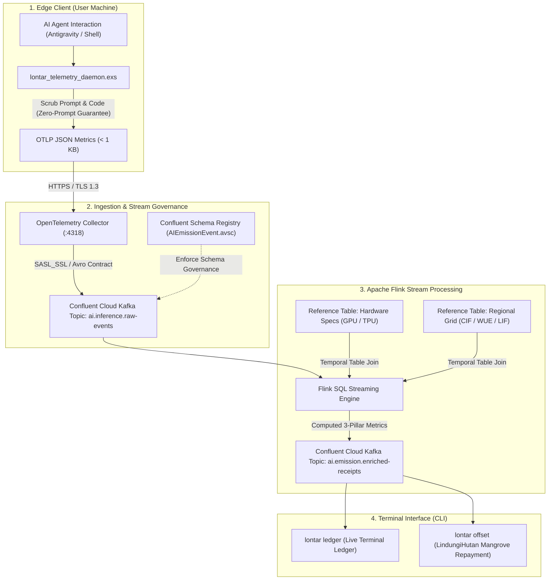

# 📜 Lontar AI Emission Ledger (Lontar AIEL)

> **Real-Time AI Environmental Accounting, Stream Governance & Ecological Literacy Engine**  
> Powered by **Confluent Cloud Kafka**, **Apache Flink Stream Processing**, and **Elixir BEAM**.

[](https://confluent.cloud)
[](https://flink.apache.org)
[](https://elixir-lang.org)
[](https://opentelemetry.io)
[](LICENSE)
[](#)

---

## 🌿 What is Lontar AIEL?

In ancient Nusantara (Indonesian) heritage, **Lontar** refers to palm-leaf manuscripts used across centuries to record wisdom, governance, science, and history with enduring permanence.

**Lontar AIEL** revives this concept for the computational age: an **immutable, real-time data streaming ledger** that captures the environmental cost of artificial intelligence—translating raw inference tokens into an auditable **3-Pillar Ecological Footprint**:

1. 💨 **Carbon Footprint ($g CO_2e$):** Atmospheric greenhouse gas emissions derived from dynamic regional grid carbon intensity ($CIF$).
2. 💧 **Water Footprint ($mL$):** Combined **on-site** datacenter evaporative cooling ($WUE_{\text{site}}$) and **off-site** power generation water ($WUE_{\text{source}}$).
3. 🌿 **Land Footprint ($cm^2$):** Direct and indirect land transformation ($LIF$) required for energy generation infrastructure (solar/wind farms, hydropower, fuel extraction).

---

## 🏛️ System Architecture: Real-Time Stream Pipeline

Lontar AIEL connects edge AI developer environments (IDE, CLI, Termux) to Confluent Cloud and Apache Flink with a strict **Zero-Prompt Retention Guarantee**.



---

## 🔄 Dual-Mode Architecture: Enterprise Cloud & Local Fallback

Lontar AIEL is engineered with **architectural resilience**. You can run it connected to enterprise cloud streams or completely offline:

| Feature | Confluent Cloud Mode (`main`) | Local Git Telemetry Mode (`local-telemetry`) |
| :--- | :--- | :--- |
| **Data Backbone** | Confluent Cloud Kafka + Apache Flink | Local JSONL + Git branch (`origin/telemetry`) |
| **Processing** | Real-time Temporal Table Joins & Watermarking | Local Elixir BEAM stream aggregation |
| **Best For** | Enterprise ESG compliance, competitions, multi-tenant | Solo operators, offline work, zero-cloud dependency |
| **Cost** | Cloud Managed | 100% Free & Open Source |
| **Switching** | Default out-of-the-box | Run `lontar ledger` in offline mode or checkout branch |

> [!TIP]
> **Automatic Fallback Guarantee:** If your Confluent Cloud cluster is paused or credentials are not set, Lontar AIEL automatically operates in local mode without throwing errors or dropping telemetry receipts.

---

## 🚀 1-Line Zero-Friction Installation

No Kafka configurations, no database setup, no complex dependencies.

### 🪟 Windows (PowerShell)
```powershell
iwr -useb https://raw.githubusercontent.com/zelasar-rmd/lontar-aiel/main/scripts/install.ps1 | iex
```

### 🐧 Linux & 🍎 macOS (Bash / Zsh)
```bash
curl -sSL https://raw.githubusercontent.com/zelasar-rmd/lontar-aiel/main/scripts/install.sh | bash
```

### 📱 Android / Termux
```bash
pkg update && pkg install -y elixir git
git clone -b main https://github.com/zelasar-rmd/lontar-aiel.git ~/lontar-aiel
mkdir -p ~/bin && echo -e '#!/usr/bin/env bash\nelixir "$HOME/lontar-aiel/scripts/calculate_emission.exs" "$@"' > ~/bin/lontar && chmod +x ~/bin/lontar
export PATH="$HOME/bin:$PATH"
lontar opt-in
```

---

## 💻 Terminal CLI Quickstart

Once installed, use the universal `lontar` command in any terminal:

```bash
# 1. Accept privacy terms & initialize background daemon
lontar opt-in

# 2. View real-time 3-pillar ecological ledger
lontar ledger

# 3. View LindungiHutan mangrove & coral reef offset options
lontar offset

# 4. Check real-time daemon & Confluent connection health
lontar status

# 5. Read the Zero-Prompt Retention Security Protocol
lontar terms
```

### Example Terminal Output (`lontar ledger`)

```text
──────────────────────────────────────────────────────────────────────────
📜 LONTAR AIEL TELEMETRY LEDGER (CONFLUENT DATA STREAM)
🕒 Latest Audit Entry   : 2026-09-22 22:15 UTC+07:00
──────────────────────────────────────────────────────────────────────────
🌐 Total Audited Sessions : 14 session(s)
📝 Cumulative Tokens     : 184,250 tokens
⚡ Total Energy Footprint : 36.850 Wh (0.03685 kWh)
💨 Total Carbon Footprint : 14.740 g CO₂e
💧 Total Cooling Water   : 92.12 mL
🌳 Total Tree Equivalent : ~352.2 minutes of tropical tree absorption
──────────────────────────────────────────────────────────────────────────
💻 MACHINE & DEVICE FOOTPRINT BREAKDOWN:
  🪟 WINDOWS    : 10 session(s) |    134,500 tok |   26.90 Wh |   10.76 g CO₂e
  📱 TERMUX     :  4 session(s) |     49,750 tok |    9.95 Wh |    3.98 g CO₂e
──────────────────────────────────────────────────────────────────────────
```

---

## 🛡️ Privacy & Security: Zero-Prompt Retention

Because Lontar AIEL operates on developer machines alongside private code and AI conversations, **privacy is non-negotiable**:

1. **Local Text Scrubbing:** Prompts, source code, and AI model outputs are **100% scrubbed locally** before any telemetry payload is constructed.
2. **Database-Free Cryptographic Identity:** No account creation or email binding. Users are identified via an anonymous deterministic hash:
   $$\text{user\_anon\_id} = \text{SHA256}(\text{Hardware MAC} + \text{salt})$$
3. **Encrypted In-Transit:** All metrics are shipped over **TLS 1.3 / SASL_SSL** to Confluent Cloud.
4. **Read the Full Protocol & Opt-In Terms:** [`docs/TERMS_AND_PRIVACY.md`](docs/TERMS_AND_PRIVACY.md) and [`docs/OPT_IN_STATEMENT.md`](docs/OPT_IN_STATEMENT.md).

---

## 🏆 Confluent Cloud & Stream Governance Assets

This project is built to demonstrate the capabilities of the Confluent Data Streaming Platform:

* **Stream Processing with Apache Flink:** Powered by managed Flink in Confluent Cloud. Uses **Temporal Table Joins** (`FOR SYSTEM_TIME AS OF`) to combine high-velocity inference event streams with slowly changing reference tables (GPU hardware power profiles and regional grid carbon/water multipliers).
* **Stream Governance (Confluent Schema Registry):** Located at [`config/confluent_schemas/AIEmissionEvent.avsc`](config/confluent_schemas/AIEmissionEvent.avsc). Enforces Avro data contract integrity for all edge ingestion.
* **OpenTelemetry Ingestion:** Configured at [`config/otel-collector-config.yaml`](config/otel-collector-config.yaml) for standard OTLP metrics collection and automated payload sanitization.

---

## 🌿 Ecological Offsets & Repayment

Lontar AIEL translates carbon footprint into actionable, local conservation actions through **LindungiHutan** (Indonesian coastal mangrove restoration):

```text
Your cumulative carbon footprint of 14.74 g CO₂e is balanced by:
  1. 🌊 LindungiHutan Mangrove Seedling : 1 Seedling = 12,300 g CO₂e/year
     • Direct Action : Sponsor 1 Mangrove seedling in Coastal Java
     • Link          : https://lindungihutan.com
  2. 🪸 Coral Reef Restoration : 1 Micro-fragment buffering in Bali Sea
```

---

## 📁 Repository Structure & Branch Preservation

```text
lontar-aiel/
├── README.md                            # Public overview (Confluent Edition)
├── config/
│   ├── confluent_schemas/               # Confluent Schema Registry contracts (.avsc)
│   └── otel-collector-config.yaml       # OpenTelemetry Collector configuration
├── docs/
│   ├── INSTALLATION_GUIDE.md            # Comprehensive multi-OS installation guide
│   ├── OPT_IN_STATEMENT.md              # Real-Time Telemetry & Open Ledger Opt-In Terms
│   ├── TERMS_AND_PRIVACY.md             # Zero-Prompt Retention Guarantee
│   └── SPECIFICATION.md                 # 3-Pillar scientific calculation formulas
└── scripts/
    ├── calculate_emission.exs           # CLI frontend & fallback calculation engine
    ├── lontar_telemetry_daemon.exs      # Real-time background Confluent streamer
    ├── install.sh                       # Linux / macOS 1-line installer
    └── install.ps1                      # Windows PowerShell 1-line installer
```

### How Branches Are Preserved

* **`main` (Default Public Branch):** Features the full **Confluent Cloud + Apache Flink** real-time streaming engine.
* **`local-telemetry` (Preserved Branch):** Preserves the original **local Git-telemetry engine** (uses Git branch `origin/telemetry` for zero-cloud, offline recording).
* To switch back to the purely local version at any time:
  ```bash
  git checkout local-telemetry
  ```

---

## 📄 License

Copyright © 2026 Lontar AIEL Contributors.

Licensed under the **Business Source License 1.1 (BUSL-1.1)**.  
* **Use Grant:** Free for testing, evaluation, research, and non-commercial competition review.  
* **Change Date:** 2028-09-22  
* **Change License:** Apache License, Version 2.0  

See [`LICENSE`](LICENSE) for complete terms.
