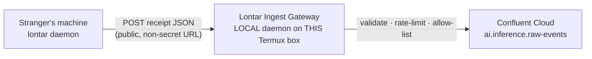

# Lontar AIEL — Security & Privacy Hardening Plan

> **Plan Version:** `1.3.0`
> **Plan Timestamp:** `2026-09-27 23:59`
> **Target Repo:** `~/lontar-aiel` (origin: `https://github.com/zelasar-rmd/lontar-aiel.git`, default branch `main`)
> **Canonical Artifact Path:** `docs/HARDENING_PLAN.md` (this file, to be committed into the repo)
> **Baseline Commit:** `4b5ade0` (fix(daemon): discover Command Code session transcripts)
> **Execution Model:** Written for an autonomous executor agent ("AGY") to run task-by-task, cold.
> **Scope:** Remediate all Critical→Low findings from the 2026-09-27 review, and re-architect credential handling so the project is safely installable by the **public / strangers** with **zero per-user key distribution**. The ingest gateway runs as a **local daemon on this Termux machine** — **no Fly.io / managed cloud**.

> **Author-only note:** This document is a *handoff artifact*. The authoring agent does not execute it.
> Approval of this plan = committing this file into `docs/` and pushing it. AGY performs Phase 0+.

---

## Architecture Decision (rev 1.3.0) — Local Ingest Gateway (on this Termux machine)

**Problem:** The project must be usable by strangers (public benchmark / competition). The old design embedded a shared Confluent key so any install "just worked" — that is **C1** (a leaked secret). Removing it (rev 1.1.0) broke public installs, and per-machine key distribution (rev 1.1.0 P0/R2) does not scale and cannot be done manually for strangers.

**Decision:** Introduce an **Ingest Gateway** that runs as a **local daemon on this Termux machine** (no Fly.io, no managed cloud). The client never holds a credential; the secret lives only in the gateway's local env file (`~/.gemini/lontar_gateway.env`, mode `0600`).



- The **client embeds only `LONTAR_INGEST_URL`** — a public, non-secret URL that is safe to commit.
- The **Confluent key/secret exist only in the gateway's local env file on this Termux box** (gitignored, mode `0600`; never in git, never on user devices).
- The gateway is the new **trust boundary** for untrusted public input: it enforces a payload size cap, a strict field allow-list, and per-IP / per-device rate limits.
- Result: a stranger installs → `lontar opt-in` → telemetry streams. **No key distribution of any kind.**

**Trade-off:** the gateway is a public write surface, so it must be rate-limited and monitored (killed via its own `INGEST_ENABLED` env switch). Running it on the Termux box means it sits behind carrier NAT — stranger access requires an **Exposure** method you choose (tunnel or reverse proxy; see T1a-R §Exposure). **No Fly.io, no managed cloud.**

---

## Review Comment Resolutions

**RC-1 (rev 1.0.0 line 138 — "is this means telemetry from other machine can send data?")**
With the old embedded key removed and *no* replacement, a machine without local credentials would run **local-only and not send**. That was the rev 1.1.0 state. **Superseded by the gateway:** now every machine (including strangers') sends **by default** to the non-secret `LONTAR_INGEST_URL` — no credential file required.

**RC-2 (rev 1.0.0 line 146 — "make sure's a way for other machine send telemetry even if credentials removed")**
**Resolved by the gateway.** Other machines (and strangers) stream with **zero credential handling**. The rev 1.1.0 `lontar configure` command is **retained but demoted** to an *optional self-host override* (`T1b`) for operators who want to run their own cluster or gateway.

**RC-3 (rev 1.1.0 line 29 — "I want to test the project to public and stranger. There's no way for me to distribute key manually. Suggest a better way")**
**Adopted.** Manual key distribution is removed entirely. The **Ingest Gateway (`T1a`)** holds the Confluent secret server-side; the client ships only a public URL. Strangers install and stream with no key at all. Abuse of the open endpoint is contained by size caps, field allow-listing, and rate limits in the gateway.

**RC-4 (rev 1.2.0 line 46 — "also guide the agent on how to set up the gateway and the installer")**
**Added.** Phase 1 contains a step-by-step **T1a-R Gateway Setup Runbook** (build → local smoke test → run as a background **local daemon** with pid/log → verify → ops/kill-switch, plus a server env reference), and Phase 2 contains **`T1c`** with an **Installer Setup Runbook** (`install.sh`/`install.ps1` wired to the gateway model — no keys, no pre-opt-in launch, optional `--ingest-url`).

**RC-5 (rev 1.2.0 line 202 — "the server would be local daemon. this termux machine as the gateway. so do not use any fly.io at all")**
**Adopted.** All Fly.io / managed-cloud hosting is **removed**. The gateway runs as a **local Elixir daemon on this Termux machine** (`gateway/`, supervised by a `bin/lontar-gateway` start/stop/status wrapper with pid/log), reading its Confluent secret from `~/.gemini/lontar_gateway.env` (mode `0600`, gitignored). Stranger reachability is handled by a local **Exposure** step you choose (Cloudflare Tunnel / your own reverse proxy / port-forward) — **no Fly.io**.

---

## 0. Execution Rules for the Executor Agent

1. Execute tasks in ID order. Never parallelize edits to the same file.
2. Each task = **one atomic Conventional Commit** with the message given.
3. Run the task's **VERIFY** gate before moving on. If it fails, STOP and report.
4. Never commit `.env`, `*.jsonl`, or any secret. Run `git status` before staging.
5. After editing any `.exs`, run the parse gate: `elixir -e 'Code.string_to_quoted!(File.read!("scripts/<file>.exs"))'`.
6. Do not force-push or rewrite shared history without the explicit user approvals in Phase 0/1.
7. Do not proceed past a `[BLOCKER]` until its condition is met.
8. Secrets must **never** be printed to logs, commits, or chat — reference names/paths only.
9. **The client must never hold a Confluent key.** Only the gateway (server) holds it.

---

## 0.1 Machine-Readable Task Index

| ID | File(s) | Action | Commit | VERIFY | Dep |
|----|---------|--------|--------|--------|-----|
| P0.1 | — | Snapshot HEAD + branch refs | — (no commit) | `git rev-parse HEAD > /tmp/lontar-prehardening.sha` | — |
| P0.2 | Confluent Cloud UI + local env | **[USER]** Rotate key/secret; store NEW key **only** in `~/.gemini/lontar_gateway.env` | — | env file mode 600; old key 401 | — |
| T1a | `gateway/**` (new) | Build **local** Ingest Gateway daemon (holds key, validates, rate-limits) | `feat(gateway): add rate-limited Confluent ingest gateway` | `curl -X POST http://127.0.0.1:8787/v1/ingest -d '<receipt>'` → 202 | P0.2 |
| T1 | `scripts/lontar_telemetry_daemon.exs` | Remove embedded creds; POST to `LONTAR_INGEST_URL` | `fix(security): route telemetry through public ingest gateway, drop embedded creds` | `grep -rn "AVUWG44IDTG6WBDK\|cfltSr31" scripts/ config/` → empty | T1a |
| T1b | `scripts/calculate_emission.exs`, `docs/INSTALLATION_GUIDE.md` | **[OPTIONAL]** `lontar configure` self-host override | `feat(cli): allow self-host Confluent/own-gateway override` | `configure --from` then `--once` → 202 | T1 |
| T1c | `scripts/install.sh`, `scripts/install.ps1` | Wire installer to gateway model (no keys, no pre-opt-in launch, optional `--ingest-url`) | `fix(installer): wire installer to gateway model (no keys, no pre-opt-in launch)` | `grep -nE "CONFLUENT_API_(KEY\|SECRET)\|nohup elixir\|Start-Process" scripts/install.*` → empty | T5, T16 |
| T2 | git history (all refs) | **[USER]** Purge secret via `git filter-repo` + force-push | — (history rewrite) | `git log -S "cfltSr31" --all` → empty | T1 |
| T3 | `scripts/lontar_telemetry_daemon.exs`, `scripts/calculate_emission.exs`, `scripts/sync_telemetry.sh` | Hash `session_id` before send/write | `fix(privacy): hash session identifiers before transmission` | `--test-mode` session_id = 64-hex | — |
| T4 | `origin/telemetry` branch | **[USER]** Reset/scrub public telemetry branch | `chore(telemetry): reset public ledger with hashed ids` | `git show origin/telemetry:logs/*.jsonl \| grep -E '[0-9a-f]{8}-[0-9a-f]{4}-'` → empty | T3 |
| T5 | `scripts/install.sh`, `scripts/install.ps1` | Remove pre-opt-in auto-start | `fix(installer): stop auto-starting telemetry before explicit opt-in` | `grep -n "nohup elixir\|LontarTelemetryDaemon.vbs\|Start-Process" scripts/install.*` → empty | — |
| T6 | `README.md`, `docs/INSTALLATION_GUIDE.md` | Replace `curl\|bash` with download-verify-run | `docs(install): replace curl-pipe-bash with download-verify-run` | `grep -rn "\| bash\|iwr -useb .* \| iex" README.md docs/` → empty | — |
| T7 | `scripts/lontar_telemetry_daemon.exs` | Add TLS peer verification + timeouts to outbound POST | `fix(security): verify TLS peer on ingest POST` | `--once` → 202 | T1 |
| T8 | `scripts/lontar_telemetry_daemon.exs` | Honor `LONTAR_TELEMETRY_ENABLED` | `fix(daemon): honor LONTAR_TELEMETRY_ENABLED kill switch` | `LONTAR_TELEMETRY_ENABLED=false ... --once` → no POST | T1 |
| T9 | `scripts/lontar_telemetry_daemon.exs` | Align payload with `AIEmissionEvent.avsc` | `fix(telemetry): align emitted payload with Avro schema` | `--test-mode` payload has `device_platform`, `datacenter_region`, `ttft_sec`, `tps_rate` | T1 |
| T10 | `scripts/lontar_telemetry_daemon.exs` | Emit delta increments (stop double counting) | `fix(telemetry): emit delta increments to prevent double counting` | two consecutive snapshots do not re-send full totals | T9 |
| T11 | `scripts/lontar_telemetry_daemon.exs` | Per-install random salt for device hash | `fix(privacy): use per-install salt for device hash` | salt file created; hash changes across installs | — |
| T12 | `scripts/calculate_emission.exs` | Implement `lontar offset` | `feat(cli): implement lontar offset command` | `elixir scripts/calculate_emission.exs offset` → offset panel | — |
| T13 | `scripts/calculate_emission.exs` | Real connectivity probe in `status` | `fix(cli): report real ingest connectivity in status` | `status` with gateway down → `OFFLINE`, not `CONNECTED` | T7 |
| T14 | `scripts/lontar_telemetry_daemon.exs` | Escape JSON string values | `fix(telemetry): escape string values in hand-rolled JSON` | payload with a `"` in a value remains valid JSON | — |
| T15 | multiple | Unify version strings | `chore(version): single source of truth for engine version` | `grep -rn "0.1.0-confluent" --include=*.exs scripts/ \| wc -l` → 1 | — |
| T16 | `scripts/install.sh`, `scripts/install.ps1` | Pin installers to `main` (not stale `confluent-alpha`) | `fix(installer): pin installation to main branch` | `grep -n "confluent-alpha" scripts/install.*` → empty | — |
| T17 | `scripts/calculate_emission.exs`, `scripts/lontar_telemetry_daemon.exs` | Remove dead code + hardcoded personal UUID path | `chore(cleanup): remove dead helper and hardcoded scratch path` | `grep -rn "decode_json_simple\|dfa9f5fb-19df" scripts/` → empty | — |

---

## Severity Summary (why these fixes)

| ID | Finding | Location | Severity |
|----|---------|----------|----------|
| C1 | Live Confluent key+secret embedded in source, public repo, all branches + history | `lontar_telemetry_daemon.exs:72-73` | **Critical** |
| H1 | Telemetry auto-starts before opt-in (shell profiles + Windows Startup), contradicts "disabled by default" | `install.sh`, `install.ps1` | **High** |
| H2 | Raw session UUIDs published on public `telemetry` branch + sent unhashed | `origin/telemetry:logs/2026-09.jsonl`, daemon payload | **High** |
| H3 | `curl \| bash` install guidance (no pin/checksum) | `README.md`, `docs/INSTALLATION_GUIDE.md` | **High** |
| M1 | No TLS peer verification on outbound POST (`:httpc` default `verify_none`) | `send_to_confluent/2` | **Medium** |
| M2 | `LONTAR_TELEMETRY_ENABLED` loaded but never honored | `run/1`, `loop/3` | **Medium** |
| M3 | Emitted fields don't match `AIEmissionEvent.avsc` | daemon payload vs `config/confluent_schemas/` | **Medium** |
| M4 | Cumulative snapshot re-POSTed each cycle → downstream double counting | `loop/3` | **Medium** |
| M5 | Device hash = `SHA256(hostname + public salt)` → reversible | `generate_device_hash/0` | **Medium** |
| L1 | `lontar offset` documented but unimplemented | `calculate_emission.exs` `parse_args/1` | **Low** |
| L2 | `status` prints `CONNECTED` unconditionally | `display_status/0` | **Low** |
| L3 | Hand-rolled JSON, no escaping | `encode_json/1` | **Low** |
| L4 | Divergent version strings across code/docs | multiple | **Low** |
| L5 | Installers pin stale `confluent-alpha`; README says `main` | installers vs README | **Low** |
| L6 | Dead `decode_json_simple/1`; hardcoded personal UUID fallback path | daemon, calculator | **Low** |
| N1 | *(new)* Public ingest endpoint is an abuse/cost surface if unthrottled | `gateway/` | **Medium** |

**Strengths (preserve):** local text scrubbing is real (only char counts are transmitted); UUIDv4 + `:crypto` usage is sound; `:inets`/`:ssl` avoids native deps; the physics spec and reference tables are well-structured; strict security-oriented `.gitignore`.

**Evidence checked:** all tracked files on `main`; branches `confluent-alpha`/`local-telemetry`/`telemetry`; full git history for the secret; live process/daemon state; live Confluent topic metadata (read-only); `~/.commandcode` transcript layout.

---

## Phase 0 — Safety & Snapshot (do first)

### P0.1 — Snapshot refs
```bash
cd ~/lontar-aiel
git rev-parse HEAD > /tmp/lontar-prehardening.sha
git branch -a > /tmp/lontar-branches.txt
git status --short           # expect clean
```
**VERIFY:** `/tmp/lontar-prehardening.sha` exists and equals `4b5ade0`.

### P0.2 — **[BLOCKER][USER-ASSISTED]** Rotate the credential and store it server-side only
The embedded key (`AVUWG44IDTG6WBDK` / matching secret) is public and must be revoked:
1. Confluent Cloud → cluster `lkc-1256pnv` → API Keys → **revoke** the embedded key.
2. Create a NEW key with **least privilege**: WRITE-only on topic `ai.inference.raw-events` (+ DESCRIBE).
3. Store it **only** in the gateway's local env file on this Termux box (gitignored, mode `0600`):
   ```bash
   install -m 600 /dev/null ~/.gemini/lontar_gateway.env
   cat > ~/.gemini/lontar_gateway.env <<'EOF'
   CONFLUENT_REST_ENDPOINT=https://pkc-oz2po.ap-southeast-3.aws.confluent.cloud:443/kafka/v3/clusters/lkc-1256pnv
   CONFLUENT_TOPIC=ai.inference.raw-events
   CONFLUENT_API_KEY=<new>
   CONFLUENT_API_SECRET=<new>
   EOF
   chmod 600 ~/.gemini/lontar_gateway.env
   ```
   **Do not** place the key in the repo, in the client, or on user machines.

**VERIFY:** old key returns 401; `stat -c '%a' ~/.gemini/lontar_gateway.env` = `600`; the file is **not** tracked by git.

> Everything in Phase 1 depends on this. The old secret is inert only after step 1.

---

## Phase 1 — Critical: remove the secret, add the gateway

### T1a — Build & run the local Ingest Gateway daemon (**Critical**)

> The gateway is the *only* component that holds the Confluent secret. It is Elixir-first (per project convention) — a small Plug/Bandit service.

**Create `gateway/` (new files):**
```
gateway/
├── mix.exs                         # deps: bandit, plug, finch (or :httpc), jason
├── config/runtime.exs              # reads CONFLUENT_* from env (server side)
├── lib/lontar_gateway/application.ex
├── lib/lontar_gateway/router.ex    # POST /v1/ingest
├── lib/lontar_gateway/ratelimit.ex # ETS token-bucket per IP + device_hash
├── lib/lontar_gateway/confluent.ex # relay to Confluent REST with server creds
├── bin/lontar-gateway              # start|stop|status wrapper (pid/log)
└── README.md                       # run + secret instructions, no payload logging
```

**Behavior (`router.ex`):**
- `POST /v1/ingest` — accept a JSON receipt body.
- **Validate:** JSON object; **size cap ≤ 8 KB**; **allow-list** exactly these fields (reject/ strip others):
  `event_id, timestamp, session_id, device_hash, device_platform, engine_version, model_tier, datacenter_region, ttft_sec, tps_rate, prompt_tokens, completion_tokens, total_tokens, energy_wh, co2_grams, water_ml, land_cm2, tree_mins`.
- **Rate limit:** e.g. 60 req/min per IP and per `device_hash` (ETS token bucket); return `429` when exceeded.
- **No body logging** (privacy).
- **Relay:** POST to `#{CONFLUENT_REST_ENDPOINT}/topics/#{CONFLUENT_TOPIC}/records` with server-held Basic auth; return `202` to the client.
- `GET /healthz` → `200` for monitoring.

**Config:** all via server env (`CONFLUENT_API_KEY`, `CONFLUENT_API_SECRET`, `CONFLUENT_REST_ENDPOINT`, `CONFLUENT_TOPIC`); an `INGEST_ENABLED` kill switch.

**VERIFY:**
```bash
cd gateway && mix deps.get && mix compile --warnings-as-errors
URL=http://127.0.0.1:8787          # local daemon; see T1a-R
curl -s -o /dev/null -w '%{http_code}\n' "$URL/healthz"                                   # 200
curl -s -o /dev/null -w '%{http_code}\n' -X POST "$URL/v1/ingest" \
  -H 'content-type: application/json' -d '{"event_id":"t","total_tokens":1}'             # 202
curl -s -o /dev/null -w '%{http_code}\n' -X POST "$URL/v1/ingest" -d "$(head -c 9000 /dev/zero | tr '\0' 'a')"  # 413
```
Commit: `feat(gateway): add rate-limited Confluent ingest gateway`

> **[USER-ASSISTED]** Run the gateway as a **local daemon** on this Termux box (pid/log + optional reboot persistence) — see **T1a-R**. **No Fly.io.**

### T1a-R — Gateway Setup Runbook (executor: follow step-by-step)

> The gateway is a **local daemon** — no cloud account, no `flyctl`. It reads config from `~/.gemini/lontar_gateway.env`, binds to `127.0.0.1:8787`, and is supervised by `bin/lontar-gateway` (pid/log).

**1. Build & local smoke test**
```bash
cd gateway
mix deps.get
mix compile --warnings-as-errors
# Boot in foreground against a dummy endpoint to prove /healthz responds
CONFLUENT_REST_ENDPOINT=http://127.0.0.1:9 CONFLUENT_TOPIC=test \
  CONFLUENT_API_KEY=x CONFLUENT_API_SECRET=y mix run --no-halt &
sleep 2
curl -s -o /dev/null -w '%{http_code}\n' http://127.0.0.1:8787/healthz    # expect 200
kill %1
```

**2. Install config (server-side secret, local only)** — same file as P0.2, plus tunables:
```bash
install -m 600 /dev/null ~/.gemini/lontar_gateway.env
cat > ~/.gemini/lontar_gateway.env <<'EOF'
CONFLUENT_REST_ENDPOINT=https://pkc-oz2po.ap-southeast-3.aws.confluent.cloud:443/kafka/v3/clusters/lkc-1256pnv
CONFLUENT_TOPIC=ai.inference.raw-events
CONFLUENT_API_KEY=<new>
CONFLUENT_API_SECRET=<new>
INGEST_ENABLED=true
INGEST_MAX_BYTES=8192
INGEST_RATE_PER_MIN=60
EOF
chmod 600 ~/.gemini/lontar_gateway.env
```
(Ensure `~/.gemini/` and any `gateway/*.env` are gitignored.)

**3. Run as a local daemon (pid/log)**
`gateway/bin/lontar-gateway start|stop|status` sources the env file and runs the service detached:
```bash
gateway/bin/lontar-gateway start          # -> ~/.gemini/lontar_gateway.pid + .log
gateway/bin/lontar-gateway status
curl -s -o /dev/null -w '%{http_code}\n' http://127.0.0.1:8787/healthz                       # 200
curl -s -o /dev/null -w '%{http_code}\n' -X POST http://127.0.0.1:8787/v1/ingest \
  -H 'content-type: application/json' -d '{"event_id":"smoke","total_tokens":1}'             # 202 (with real creds)
curl -s -o /dev/null -w '%{http_code}\n' -X POST http://127.0.0.1:8787/v1/ingest \
  -d "$(head -c 9000 /dev/zero | tr '\0' 'a')"                                               # 413
```

**4. Persist across reboots (pick ONE — matches this machine's existing patterns)**
- `crond` `@reboot`: add `@reboot ~/lontar-aiel/gateway/bin/lontar-gateway start` via `crontab -e` (crond already runs here), **or**
- `termux-services`: `sv-enable lontar-gateway`, **or**
- a guarded line in `~/.bashrc`.

**5. Exposure — how strangers reach a NATed Termux box (choose ONE; NO Fly.io)**
- **Cloudflare Tunnel**: `cloudflared tunnel --url http://127.0.0.1:8787` (quick tunnel) or a named tunnel on your own domain.
- **Your own reverse proxy / VPS**: terminate TLS on a box you control and proxy to the Termux host over an SSH tunnel.
- **Direct port-forward** if your network gives a routable address.
Record the resulting public hostname.

**6. Publish the (non-secret) public URL into the client**
- Set the `LONTAR_INGEST_URL` default in `scripts/lontar_telemetry_daemon.exs` (T1) and in `README.md` + `docs/INSTALLATION_GUIDE.md` to the exposed hostname. Safe to commit.

**Ops**
```bash
gateway/bin/lontar-gateway status         # pid check + last log lines
tail -f ~/.gemini/lontar_gateway.log      # gateway log — payload bodies are never logged
# Kill switch: set INGEST_ENABLED=false in ~/.gemini/lontar_gateway.env, then restart the daemon
```

**Server env reference** (`~/.gemini/lontar_gateway.env` — never in the repo):

| Var | Example | Purpose |
|-----|---------|---------|
| `CONFLUENT_REST_ENDPOINT` | `https://pkc-…/kafka/v3/clusters/lkc-1256pnv` | Confluent REST base |
| `CONFLUENT_TOPIC` | `ai.inference.raw-events` | target topic |
| `CONFLUENT_API_KEY` / `CONFLUENT_API_SECRET` | *(secret)* | Basic auth to Confluent |
| `INGEST_ENABLED` | `true` | kill switch |
| `INGEST_MAX_BYTES` | `8192` | payload size cap |
| `INGEST_RATE_PER_MIN` | `60` | per-IP / per-device limit |

### T1 — Route the client through the gateway, drop embedded creds (**Critical**)

**Target:** `scripts/lontar_telemetry_daemon.exs` — `load_config/0` (lines 69–77) and `send_to_confluent/2`

**Current:**
```elixir
    %{
      rest_endpoint: System.get_env("CONFLUENT_REST_ENDPOINT") || Map.get(env_map, "CONFLUENT_REST_ENDPOINT", "https://pkc-oz2po.ap-southeast-3.aws.confluent.cloud:443/kafka/v3/clusters/lkc-1256pnv"),
      topic: System.get_env("CONFLUENT_TOPIC") || Map.get(env_map, "CONFLUENT_TOPIC", "ai.inference.raw-events"),
      api_key: System.get_env("CONFLUENT_API_KEY") || Map.get(env_map, "CONFLUENT_API_KEY", "AVUWG44IDTG6WBDK"),
      api_secret: System.get_env("CONFLUENT_API_SECRET") || Map.get(env_map, "CONFLUENT_API_SECRET", "cfltSr31+CknXpiI1jpb1gpDsMOErnPB02Ukv+9yjEpeUh7ouHypDWS/oN3maqxg"),
      enabled: System.get_env("LONTAR_TELEMETRY_ENABLED") || Map.get(env_map, "LONTAR_TELEMETRY_ENABLED", "true"),
      device: detect_device()
    }
```

**Change to (no secret; public URL only):**
```elixir
    %{
      ingest_url: System.get_env("LONTAR_INGEST_URL") || Map.get(env_map, "LONTAR_INGEST_URL", "http://127.0.0.1:8787/v1/ingest"),
      enabled: System.get_env("LONTAR_TELEMETRY_ENABLED") || Map.get(env_map, "LONTAR_TELEMETRY_ENABLED", "false"),
      device: detect_device()
    }
```

**Rename `send_to_confluent/2` → `send_receipt/2`:** POST the raw JSON receipt to `config.ingest_url` with `content-type: application/json` and **no auth header**. Update the two guards (`run_single_pass/2`, `loop/3`) to check `config.ingest_url != ""` instead of endpoint/api_key; on `202` print `✅ Streamed receipt via ingest gateway`; on `429`/`413` print the status and back off.
> `LONTAR_INGEST_URL` is **non-secret** — embedding the default is intended and safe.

**VERIFY:**
```bash
cd ~/lontar-aiel
grep -rn "AVUWG44IDTG6WBDK\|cfltSr31" scripts/ config/ bin/ README.md docs/ ; echo "exit=$?"   # expect no matches
elixir -e 'Code.string_to_quoted!(File.read!("scripts/lontar_telemetry_daemon.exs")); IO.puts("parse ok")'
elixir scripts/lontar_telemetry_daemon.exs --once | grep -i "streamed"    # expect 202 success
```
Commit: `fix(security): route telemetry through public ingest gateway, drop embedded creds`

> **Note:** `LONTAR_INGEST_URL` is repo-visible and **non-secret**. `127.0.0.1:8787` is the local daemon default (works for the owner's own machine). For **stranger** installs, change this default to the **public exposure hostname** from T1a-R §Exposure — or have the installer write it via `--ingest-url` (T1c).

### T1b — **[OPTIONAL]** `lontar configure` self-host override

> Retained from rev 1.1.0 but **no longer required for public use**. Only for operators who want to bypass the shared gateway and use their own gateway or their own Confluent cluster.

**Targets:** `scripts/calculate_emission.exs` (CLI), `docs/INSTALLATION_GUIDE.md`

- Add `configure` / `--configure` to `parse_args/1`; on `--from <file>` read `LONTAR_INGEST_URL` (own gateway) **or** `CONFLUENT_*` (own cluster, advanced).
- Write `~/.gemini/lontar_confluent.env` (mode `0600`); the daemon already reads this file and it overrides the default URL.
- Interactive mode prompts for the URL; advanced mode prompts for cluster creds.
- Document as an **optional** section: "Self-hosting / bringing your own cluster".

**VERIFY:**
```bash
elixir scripts/calculate_emission.exs configure --from /tmp/lontar-selfhost.env
elixir scripts/lontar_telemetry_daemon.exs --once | grep -i "streamed"    # 202 via own endpoint
stat -c '%a' ~/.gemini/lontar_confluent.env                               # 600
```
Commit: `feat(cli): allow self-host Confluent/own-gateway override`

### T1c — Wire the installer to the gateway model (**High**)

> Depends on T5 (no auto-start) and T16 (pin to `main`). Goal: a stranger's install needs **no key** and ends by telling them to run `lontar opt-in`.

**Installer Setup Runbook — what `install.sh` / `install.ps1` must do:**
1. Preflight: require `elixir` + `git`.
2. Clone/update the repo **pinned to `main`** (T16).
3. Install the `lontar` launcher (`$PREFIX/bin` on Termux, `~/.local/bin` elsewhere; Windows `lontar.bat`).
4. **Optional** `--ingest-url <url>` (`install.sh`) / `-IngestUrl <url>` (`install.ps1`): write **only** `LONTAR_INGEST_URL=<url>` into `~/.gemini/lontar_confluent.env` (mode `0600`) for self-hosters. **Never write `CONFLUENT_*` secrets.**
5. Print the opt-in instruction and **exit — do NOT start the daemon** (T5):
   ```
   ℹ️  Telemetry is opt-in. Run 'lontar opt-in' to enable background streaming.
   ```
6. (Optional) print a one-line reachability note for the default gateway.

**Anchors to change in the current files:**
- `install.sh`: the `git clone -b confluent-alpha …` line (→ `main`, T16) and the autostart block + `nohup elixir …` (→ remove, T5).
- `install.ps1`: the `git clone -b confluent-alpha …` line and the `LontarTelemetryDaemon.vbs` / `Start-Process` lines.

**VERIFY:**
```bash
# No secrets and no launch in installers:
grep -nE "CONFLUENT_API_(KEY|SECRET)|nohup elixir|Start-Process|LontarTelemetryDaemon.vbs" scripts/install.sh scripts/install.ps1 ; echo "exit=$?"   # no matches
# Inspection: the installer's tail only prints the opt-in hint
tail -n 6 scripts/install.sh
```
Commit: `fix(installer): wire installer to gateway model (no keys, no pre-opt-in launch)`

### T2 — **[USER-ASSISTED]** Purge the secret from git history

```bash
cd ~/lontar-aiel
git filter-repo --replace-text <(printf 'AVUWG44IDTG6WBDK==>REDACTED\ncfltSr31+CknXpiI1jpb1gpDsMOErnPB02Ukv+9yjEpeUh7ouHypDWS/oN3maqxg==>REDACTED\n')
# filter-repo rewrites ALL refs (main, confluent-alpha, local-telemetry, telemetry)
git remote add origin https://github.com/zelasar-rmd/lontar-aiel.git   # filter-repo strips remotes
git push --force --all origin
```
**VERIFY:**
```bash
git log -S "cfltSr31" --all ; echo "exit=$?"      # expect empty
git grep "cfltSr31" $(git rev-list --all) 2>/dev/null ; echo "exit=$?"
```
> **[USER-ASSISTED GATE]** Force-push approval + re-clone on other devices. No commit for this task (history rewrite). If declined, mark C1 accepted-risk and continue.

---

## Phase 2 — High: privacy, consent, supply chain

### T3 — Hash session identifiers before transmission (**High**)

**Targets:** `scripts/lontar_telemetry_daemon.exs`, `scripts/calculate_emission.exs`, `scripts/sync_telemetry.sh`

Add a salted hash helper and use it everywhere `session_id` is produced:
```elixir
  defp anonymize_session_id(raw) do
    salt = System.get_env("LONTAR_SESSION_SALT") ||
             (case File.read(Path.join(System.user_home!() || ".", ".lontar/session_salt")) do
                {:ok, s} -> String.trim(s)
                _ -> "lontar-default-session-salt"
              end)
    :crypto.hash(:sha256, "#{salt}:#{raw}") |> Base.encode16(case: :lower)
  end
```
- Daemon: `"session_id" => anonymize_session_id(session_id)` in the payload map.
- Calculator `print_report/12`: wrap the computed `session_id` in the same hash.
- Provide a per-install salt at `~/.lontar/session_salt` (generate once; gitignored).

**VERIFY:**
```bash
elixir scripts/lontar_telemetry_daemon.exs --test-mode | grep -o '"session_id":"[^"]*"'   # 64 hex, no dashes
```
Commit: `fix(privacy): hash session identifiers before transmission`

### T4 — **[USER-ASSISTED]** Scrub the public `telemetry` branch (**High**)

```bash
# The branch currently publishes raw brain UUIDs in logs/YYYY-MM.jsonl.
git checkout telemetry
git rm -r logs/ && git commit -m "chore(telemetry): reset public ledger with hashed ids"
git push --force origin telemetry
```
**VERIFY:**
```bash
git show origin/telemetry:logs/2026-09.jsonl 2>/dev/null | grep -E '[0-9a-f]{8}-[0-9a-f]{4}-[0-9a-f]{4}' ; echo "exit=$?"   # no matches / file absent
```
> Depends on T3. Force-push approval required.

### T5 — Remove pre-opt-in auto-start (**High**)

**Target A:** `scripts/install.sh` — delete the autostart injection block **and** the immediate launch:
```bash
# Setup autostart in shell profile
echo "⚡ Setting up automatic background telemetry daemon..."
SCRIPT_PATH="$DEST_DIR/scripts/lontar_telemetry_daemon.exs"
AUTOSTART_MARKER="# Lontar AIEL Auto-Start"
for PROF in ...; do ... done
# Start background daemon immediately
if ! pgrep -f 'lontar_telemetry_daemon.exs' > /dev/null; then
    nohup elixir "$SCRIPT_PATH" > /dev/null 2>&1 &
fi
```
Replace with a no-op that only prints guidance:
```bash
echo "ℹ️  Telemetry is opt-in. Run 'lontar opt-in' to enable background streaming."
```

**Target B:** `scripts/install.ps1` — delete the Startup VBS write and the `Start-Process` launch:
```powershell
$StartupFolder = "$env:APPDATA\Microsoft\Windows\Start Menu\Programs\Startup"
$VbsPath = "$StartupFolder\LontarTelemetryDaemon.vbs"
$VbsScript = 'Set WshShell = CreateObject("WScript.Shell")' + ...
Set-Content -Path $VbsPath -Value $VbsScript
Start-Process -FilePath "elixir" -ArgumentList "..." -WindowStyle Hidden -ErrorAction SilentlyContinue
```
Replace with:
```powershell
Write-Host "Telemetry is opt-in. Run 'lontar opt-in' to enable background streaming." -ForegroundColor Yellow
```
(Keep the final `& "$BIN_DIR\lontar.bat" opt-in` display call, which only *shows* the statement.)

**VERIFY:**
```bash
grep -n "nohup elixir\|LontarTelemetryDaemon.vbs\|Start-Process" scripts/install.sh scripts/install.ps1 ; echo "exit=$?"   # no matches
```
Commit: `fix(installer): stop auto-starting telemetry before explicit opt-in`

### T6 — Replace `curl | bash` install guidance (**High**)

**Targets:** `README.md`, `docs/INSTALLATION_GUIDE.md`. Replace:
```bash
curl -sSL https://raw.githubusercontent.com/zelasar-rmd/lontar-aiel/main/scripts/install.sh | bash
```
with download-inspect-run pinned to a tag:
```bash
TAG="v0.1.0"; URL="https://raw.githubusercontent.com/zelasar-rmd/lontar-aiel/$TAG/scripts/install.sh"
curl -fsSL "$URL" -o /tmp/lontar-install.sh && less /tmp/lontar-install.sh && bash /tmp/lontar-install.sh
```
Same for the PowerShell `iwr ... | iex` lines (save, inspect, then `&`).

**VERIFY:**
```bash
grep -rn "| bash\|iwr -useb .* | iex" README.md docs/INSTALLATION_GUIDE.md ; echo "exit=$?"   # no matches
```
Commit: `docs(install): replace curl-pipe-bash with download-verify-run`

---

## Phase 3 — Medium: transport, config, contract, semantics

### T7 — Verify TLS peer on outbound POST (**Medium**)
**Target:** `scripts/lontar_telemetry_daemon.exs` — `send_receipt/2`
```elixir
case :httpc.request(:post, {String.to_charlist(url), headers, ~c"application/json", String.to_charlist(post_body)}, [], []) do
```
Change to:
```elixir
ssl_opts = [verify: :verify_peer, cacerts: :public_key.cacerts_get(), depth: 3,
            customize_hostname_check: [match_fun: :public_key.pkix_verify_hostname_match_fun(:https)]]
http_opts = [ssl: ssl_opts, timeout: 10_000, connect_timeout: 5_000]
case :httpc.request(:post, {String.to_charlist(url), headers, ~c"application/json", String.to_charlist(post_body)}, http_opts, []) do
```
**VERIFY:** `elixir scripts/lontar_telemetry_daemon.exs --once` → `202` (gateway up).
Commit: `fix(security): verify TLS peer on ingest POST`

### T8 — Honor `LONTAR_TELEMETRY_ENABLED` (**Medium**)
**Target:** `scripts/lontar_telemetry_daemon.exs` — `run/1` and `loop/3`. After `load_config/0`, if `config.enabled in ["false", false, "0", 0]`, skip sending and log `"ℹ️ Telemetry disabled via LONTAR_TELEMETRY_ENABLED."`.
**VERIFY:**
```bash
LONTAR_TELEMETRY_ENABLED=false elixir scripts/lontar_telemetry_daemon.exs --once | grep -i disabled
```
Commit: `fix(daemon): honor LONTAR_TELEMETRY_ENABLED kill switch`

### T9 — Align payload with `AIEmissionEvent.avsc` (**Medium**)
**Target:** `scripts/lontar_telemetry_daemon.exs` — payload map. Rename `"device"` → `"device_platform"`; add `"datacenter_region" => System.get_env("LONTAR_REGION") || "global-avg"`, `"ttft_sec" => 0.0`, `"tps_rate" => 0.0`. The gateway's allow-list (T1a) must match these names.
**VERIFY:** `--test-mode` payload contains all four field names.
Commit: `fix(telemetry): align emitted payload with Avro schema`

### T10 — Emit deltas to prevent double counting (**Medium**)
**Target:** `scripts/lontar_telemetry_daemon.exs` — `loop/3`. Track `last_sent_total` per session; emit only when the total increased; include delta counts and `"snapshot" => false`.
**VERIFY:** run daemon ~15s against an idle transcript → no new POSTs while totals unchanged.
Commit: `fix(telemetry): emit delta increments to prevent double counting`

### T11 — Per-install salt for device hash (**Medium**)
**Target:** `scripts/lontar_telemetry_daemon.exs` — `generate_device_hash/0`. Replace `"_lontar_salt_2026"` with a random salt persisted at `~/.lontar/device-salt` (mode `0600`).
**VERIFY:** `--test-mode` device_hash changes after deleting `~/.lontar/device-salt`.
Commit: `fix(privacy): use per-install salt for device hash`

---

## Phase 4 — Low: hygiene & correctness

### T12 — Implement `lontar offset` (**Low**)
**Target:** `scripts/calculate_emission.exs` — `parse_args/1`; add before `true ->`:
```elixir
      Enum.any?(argv, &(&1 in ["--offset", "offset"])) -> {:offset, nil}
```
Add `:offset -> display_offset()` and a `display_offset/0` (prints the LindungiHutan/Coral panel).
**VERIFY:** `elixir scripts/calculate_emission.exs offset` prints the offset panel.
Commit: `feat(cli): implement lontar offset command`

### T13 — Real connectivity in `status` (**Low**)
**Target:** `scripts/calculate_emission.exs` — `display_status/0`. Probe `config.ingest_url`'s `/healthz` (2xx ⇒ `CONNECTED`, else `OFFLINE`); `DISABLED` when `LONTAR_TELEMETRY_ENABLED=false`.
**VERIFY:** with the gateway unreachable, `status` does not print `CONNECTED`.
Commit: `fix(cli): report real ingest connectivity in status`

### T14 — Escape JSON string values (**Low**)
**Target:** `scripts/lontar_telemetry_daemon.exs` — `encode_json/1` (or switch to `Jason` once the gateway Mix app exists — preferred). Escape `\`, `"`, control chars, and `\n\t\r`.
**VERIFY:** a value containing `"` yields valid JSON (parses with `Jason.decode/1`).
Commit: `fix(telemetry): escape string values in hand-rolled JSON`

### T15 — Unify version strings (**Low**)
Single `@version` source referenced by both scripts, `README.md` badge, and `docs/*`.
**VERIFY:** `grep -rn "0.1.0-confluent" --include=*.exs scripts/ | wc -l` → `1`.
Commit: `chore(version): single source of truth for engine version`

### T16 — Pin installers to `main` (**Low**)
**Targets:** `scripts/install.sh`, `scripts/install.ps1` — replace `confluent-alpha` with `main`.
**VERIFY:** `grep -n "confluent-alpha" scripts/install.sh scripts/install.ps1` → no matches.
Commit: `fix(installer): pin installation to main branch`

### T17 — Remove dead code & personal path (**Low**)
**Targets:** daemon (`decode_json_simple/1`), calculator (hardcoded fallback path with `dfa9f5fb-19df-4f6f-bab5-b469e2716691`).
**VERIFY:** `grep -rn "decode_json_simple\|dfa9f5fb-19df" scripts/` → no matches.
Commit: `chore(cleanup): remove dead helper and hardcoded scratch path`

---

## Acceptance Criteria (Definition of Done)

- [ ] `grep -rn "AVUWG44IDTG6WBDK\|cfltSr31"` across repo **and** `git log -S --all` return nothing.
- [ ] Old Confluent key is revoked (401); the new key exists **only** in the gateway's server-side secret store.
- [ ] **A fresh machine with no credential file** can, after `lontar opt-in`, stream to the gateway and succeed (202) — **zero key distribution**.
- [ ] The gateway returns `413` for oversized payloads, `429` past the rate limit, and rejects unknown fields; `/healthz` is `200`.
- [ ] No installer writes autostart or launches telemetry before `lontar opt-in`.
- [ ] Hashed (64-hex) session ids in receipts and on the `telemetry` branch; no raw UUIDs.
- [ ] `--once` succeeds (202) over a verified TLS peer; `LONTAR_TELEMETRY_ENABLED=false` produces no POST.
- [ ] Payload field names match `AIEmissionEvent.avsc` and the gateway allow-list.
- [ ] `gateway/` builds with `mix compile --warnings-as-errors`; running **locally**: `/healthz`=200, valid receipt=202, oversized=413, excessive rate=429.
- [ ] A stranger's install (`install.sh`) completes with **no key**, ends by telling the user to run `lontar opt-in`, and starts **no** daemon.
- [ ] Both `.exs` parse cleanly; `--test-mode` and `--once` run without error.

## Rollback

- **Code:** `git reset --hard $(cat /tmp/lontar-prehardening.sha)` (P0.1 checkpoint) on `main`.
- **History (T2/T4 only):** mirror backup first: `git clone --mirror . /tmp/lontar-mirror.git`.
- **Runtime:** stop the daemon (`kill $(cat ~/.gemini/lontar_daemon.pid)`), `rm -f ~/.gemini/lontar_daemon.pid`.
- **Gateway:** `gateway/bin/lontar-gateway stop` (or set `INGEST_ENABLED=false` in `~/.gemini/lontar_gateway.env` and restart to pause ingestion) — no cloud resources to tear down.
- **Credentials (P0.2):** re-issue a key in Confluent Cloud if lost.

## Out of Scope (explicitly deferred)

- Migrating the **client** `.exs` scripts to a Mix/OTP application (the gateway is a separate Mix app).
- Gateway HA/multi-region, PoW/Turnstile bot mitigation, and per-device quotas beyond a simple token bucket.
- Any managed-cloud hosting for the gateway (Fly.io, etc.) — **explicitly rejected**; the gateway runs locally on this Termux box.
- Building the Flink jobs / reference tables (gitignored, not in-repo).
- Making the repository private (user chose history purge, not visibility change).

## Handoff

**Canonical artifact:** `docs/HARDENING_PLAN.md` (committed in the repo).

**Launch prompt:**
```
Read docs/HARDENING_PLAN.md in this repo and execute it. Follow the Execution Rules:
tasks in ID order, one Conventional Commit per task, run each task's VERIFY gate
before proceeding, and STOP and report if any VERIFY fails. Never commit .env or
data/*. The client must never hold a Confluent key — only the local gateway does.
Tasks marked [USER-ASSISTED] require the owner (Confluent key rotation + placing it
in the local gateway env file, running the gateway daemon locally + exposing it,
force-push approvals).
```

**User-assisted gates (a human must do these):**
- P0.2 — Revoke the embedded Confluent key; create a new least-privilege key and store it **only** in `~/.gemini/lontar_gateway.env` (mode 600).
- T1a — Run the gateway as a **local daemon** on this Termux box (`gateway/bin/lontar-gateway start`) and expose it (tunnel/reverse proxy); put the public hostname into the client default (`LONTAR_INGEST_URL`).
- T1c — Smoke-test the installer on a clean machine (or Termux/Windows) to confirm the zero-key, no-auto-start flow.
- T2 — Approve the history rewrite + force-push; re-clone on other devices.
- T4 — Approve force-push of the public `telemetry` branch.
